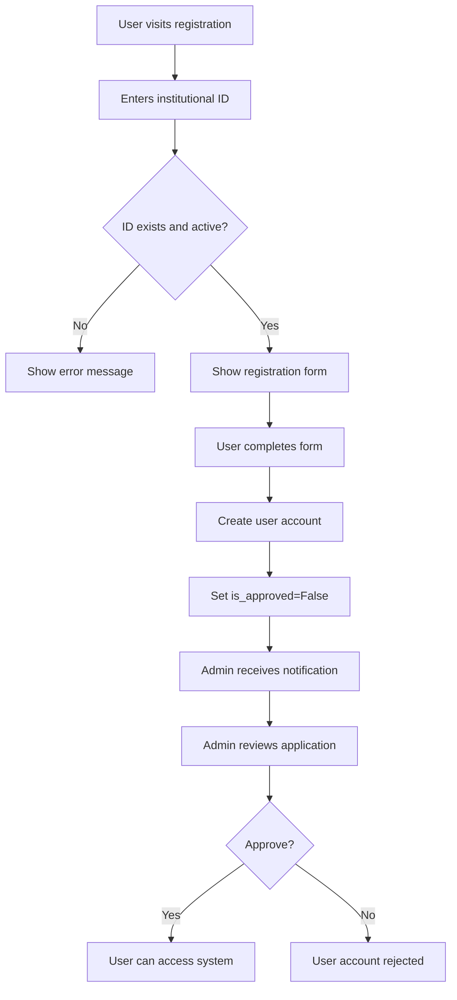

# 📚 Academic Library System - Complete Development Guide & System Report

## 🎯 **Project Overview**

The Academic Library is a Django-based web application designed for institutional book and document management. It provides a comprehensive digital library solution with user authentication, institutional verification, administrative controls, and book borrowing management.

---

## 🏗️ **System Architecture**

### **Technology Stack**
- **Backend Framework**: Django 5.2.6 (Python web framework)
- **Database**: SQLite (development) / MySQL (production)
- **Frontend**: HTML5, CSS3, JavaScript, Bootstrap
- **Authentication**: Django's built-in authentication system
- **File Handling**: Django's file upload system with Pillow
- **Deployment**: cPanel shared hosting ready

### **Project Structure**
```
Academic_Library/
├── online_library/          # Main project configuration
│   ├── __init__.py
│   ├── settings.py         # Django settings & configuration
│   ├── urls.py            # Main URL routing
│   └── wsgi.py            # WSGI configuration for deployment
├── apps/                   # Django applications
│   ├── accounts/          # User management & authentication
│   └── library/           # Library functionality
├── static/                # Static files (CSS, JS, images)
├── media/                 # Uploaded files (books, documents)
├── templates/             # HTML templates
└── manage.py             # Django management script
```

---

## 🔧 **Step-by-Step Development Process**

### **Phase 1: Project Initialization**

#### **1.1 Django Project Setup**
```bash
# Create Django project
django-admin startproject online_library

# Create Django apps
python manage.py startapp accounts
python manage.py startapp library

# Initial migration
python manage.py migrate
```

#### **1.2 Settings Configuration**
```python
# online_library/settings.py
INSTALLED_APPS = [
    'django.contrib.admin',
    'django.contrib.auth',
    'django.contrib.contenttypes',
    'django.contrib.sessions',
    'django.contrib.messages',
    'django.contrib.staticfiles',
    'apps.accounts',    # Custom user management
    'apps.library',     # Library functionality
]

# Custom user model
AUTH_USER_MODEL = 'accounts.User'
```

#### **1.3 URL Structure Design**
```python
# Main URL configuration
urlpatterns = [
    path('admin/', admin.site.urls),
    path('', include('apps.library.urls')),
    path('accounts/', include('apps.accounts.urls')),
]
```

### **Phase 2: Database Design & Models**

#### **2.1 Custom User Model (apps/accounts/models.py)**
```python
class User(AbstractUser):
    """Extended user model with institutional verification"""
    institutional_id = models.ForeignKey('InstitutionalID', ...)
    is_approved = models.BooleanField(default=False)
    profile_picture = models.ImageField(...)
    phone_number = models.CharField(...)
    address = models.TextField(...)
    date_of_birth = models.DateField(...)
```

**Key Features:**
- Extends Django's AbstractUser
- Links to institutional verification system
- Admin approval workflow
- Additional profile fields

#### **2.2 Institutional ID Model**
```python
class InstitutionalID(models.Model):
    """Pre-approved institutional IDs for registration"""
    institutional_id = models.CharField(max_length=20, unique=True)
    account_type = models.CharField(choices=ACCOUNT_TYPES)
    status = models.CharField(choices=STATUS_CHOICES)
    academic_level = models.CharField(choices=ACADEMIC_LEVELS)
```

**Purpose:**
- Pre-approved ID verification system
- Controls who can register
- Supports different account types (student/staff)
- Tracks usage and expiration

#### **2.3 Library Models (apps/library/models.py)**
```python
class Category(models.Model):
    """Book categories for organization"""
    name = models.CharField(max_length=100)
    description = models.TextField()

class Book(models.Model):
    """Main book/document model"""
    title = models.CharField(max_length=200)
    author = models.CharField(max_length=200)
    isbn = models.CharField(max_length=13)
    category = models.ForeignKey(Category)
    file = models.FileField(upload_to='books/')
    cover_image = models.ImageField(upload_to='covers/')
    uploaded_by = models.ForeignKey(User)

class BorrowRecord(models.Model):
    """Tracks book borrowing"""
    user = models.ForeignKey(User)
    book = models.ForeignKey(Book)
    borrowed_date = models.DateTimeField(auto_now_add=True)
    due_date = models.DateTimeField()
    returned_date = models.DateTimeField(null=True)
    status = models.CharField(choices=STATUS_CHOICES)
```

### **Phase 3: Authentication System**

#### **3.1 Registration Process**
```python
# apps/accounts/views.py
def register(request):
    """Multi-step registration with institutional verification"""
    if request.method == 'POST':
        # Validate institutional ID
        institutional_id = request.POST.get('institutional_id')
        id_obj = InstitutionalID.objects.get(
            institutional_id=institutional_id,
            status='active'
        )
        
        # Create user (pending approval)
        user = User.objects.create_user(
            institutional_id=id_obj,
            is_approved=False  # Requires admin approval
        )
```

**Registration Flow:**
1. User enters institutional ID
2. System validates ID exists and is active
3. User completes profile information
4. Account created in pending state
5. Admin receives notification for approval
6. Admin approves/rejects account

#### **3.2 Authentication Views**
- **Login**: Custom login with institutional verification
- **Logout**: Standard Django logout
- **Password Reset**: Email-based password recovery
- **Profile Management**: Update user information

### **Phase 4: Library Functionality**

#### **4.1 Book Management System**
```python
# apps/library/views.py
class BookListView(ListView):
    """Display all books with search and filtering"""
    model = Book
    paginate_by = 12
    
    def get_queryset(self):
        queryset = Book.objects.filter(is_available=True)
        search_query = self.request.GET.get('search')
        if search_query:
            queryset = queryset.filter(
                Q(title__icontains=search_query) |
                Q(author__icontains=search_query)
            )
        return queryset
```

**Features Implemented:**
- Book listing with pagination
- Search functionality (title, author, ISBN)
- Category filtering
- Book upload for staff members
- Cover image handling
- File download system

#### **4.2 Borrowing System**
```python
class BorrowBookView(LoginRequiredMixin, CreateView):
    """Handle book borrowing requests"""
    model = BorrowRecord
    
    def form_valid(self, form):
        # Check user permissions and book availability
        if not self.request.user.is_approved:
            return redirect('pending_approval')
            
        # Create borrow record
        form.instance.user = self.request.user
        form.instance.due_date = timezone.now() + timedelta(days=14)
        return super().form_valid(form)
```

**Borrowing Features:**
- Book availability checking
- Automatic due date calculation
- Borrow history tracking
- Return processing
- Overdue notifications

### **Phase 5: Admin Interface**

#### **5.1 Custom Admin Configuration**
```python
# apps/accounts/admin.py
@admin.register(User)
class UserAdmin(admin.ModelAdmin):
    list_display = ['username', 'email', 'is_approved', 'institutional_id']
    list_filter = ['is_approved', 'institutional_id__account_type']
    actions = ['approve_users', 'bulk_import_ids']
    
    def approve_users(self, request, queryset):
        """Bulk approve selected users"""
        queryset.update(is_approved=True)
```

**Admin Features:**
- User approval workflow
- Institutional ID management
- Bulk operations
- Book management
- Borrowing records oversight
- Category management

#### **5.2 Dashboard & Analytics**
```python
def admin_dashboard(request):
    """Admin dashboard with key statistics"""
    context = {
        'total_users': User.objects.count(),
        'pending_approvals': User.objects.filter(is_approved=False).count(),
        'total_books': Book.objects.count(),
        'active_borrows': BorrowRecord.objects.filter(status='borrowed').count(),
    }
    return render(request, 'admin/dashboard.html', context)
```

### **Phase 6: Frontend Development**

#### **6.1 Template Structure**
```html
<!-- Base template with navigation -->
<!DOCTYPE html>
<html>
<head>
    <title>Academic Library</title>
    <link href="" rel="stylesheet">
</head>
<body>
    <nav class="navbar">
        <!-- Navigation with user-specific content -->
    </nav>
    
    <main>
        
    </main>
    
    <footer>
        <!-- Footer with About/FAQ links -->
    </footer>
</body>
</html>
```

#### **6.2 Responsive Design**
- **CSS Grid & Flexbox**: Modern layout techniques
- **Bootstrap Integration**: Component styling
- **Mobile-First Design**: Responsive breakpoints
- **Custom CSS Variables**: Consistent theming

```css
:root {
    --library-primary: #1e3a8a;
    --library-secondary: #3b82f6;
    --library-accent: #60a5fa;
}

.book-grid {
    display: grid;
    grid-template-columns: repeat(auto-fit, minmax(300px, 1fr));
    gap: 2rem;
}
```

#### **6.3 Interactive Features**
- **Search Functionality**: Real-time search with AJAX
- **File Upload**: Drag-and-drop interface
- **Modal Dialogs**: Book details and actions
- **Form Validation**: Client-side and server-side validation

---

## 🔑 **Key System Components**

### **1. Authentication & Authorization System**

#### **How it Works:**
1. **Institutional Verification**: Users must use pre-approved institutional IDs
2. **Admin Approval**: New registrations require admin approval
3. **Role-Based Access**: Different permissions for students vs. staff
4. **Session Management**: Secure login sessions with timeout

#### **Security Features:**
- CSRF protection on all forms
- Password validation requirements
- Login attempt limiting
- Secure file upload validation

### **2. Book Management System**

#### **Upload Process:**
```python
def handle_book_upload(request):
    """Process book file uploads with validation"""
    if request.method == 'POST':
        file = request.FILES.get('book_file')
        
        # Validate file type and size
        if not validate_file_extension(file):
            return JsonResponse({'error': 'Invalid file type'})
            
        if file.size > MAX_FILE_SIZE:
            return JsonResponse({'error': 'File too large'})
            
        # Save with secure filename
        book = Book(
            file=file,
            uploaded_by=request.user,
            upload_date=timezone.now()
        )
        book.save()
```

#### **Search & Discovery:**
- **Multi-field Search**: Title, author, ISBN, description
- **Category Filtering**: Browse by subject areas
- **Sorting Options**: Date, popularity, alphabetical
- **Pagination**: Efficient large dataset handling

### **3. Borrowing Management System**

#### **Workflow:**
1. User requests to borrow a book
2. System checks availability and user permissions
3. Creates borrow record with automatic due date
4. Updates book availability status
5. Sends notifications (future enhancement)
6. Tracks return and calculates overdue status

### **4. Administrative Dashboard**

#### **Key Metrics Tracked:**
- Total registered users
- Pending approval requests
- Total books in library
- Active borrowing records
- Popular books and categories
- System usage statistics

---

## 🚀 **Deployment Architecture**

### **Development Environment**
```bash
# Local development setup
python manage.py runserver
# Uses SQLite database
# DEBUG = True
# Static files served by Django
```

### **Production Deployment (cPanel)**
```python
# passenger_wsgi.py
import os
import sys

# Production configuration
project_home = '/home/username/domain.com/Academic_Library'
os.environ['DJANGO_SETTINGS_MODULE'] = 'online_library.settings'

# Production settings
DEBUG = False
ALLOWED_HOSTS = ['yourdomain.com', 'www.yourdomain.com']
DATABASES = {
    'default': {
        'ENGINE': 'django.db.backends.mysql',
        # MySQL configuration for cPanel
    }
}
```

### **File Structure for Deployment**
```
/home/username/domain.com/
├── Academic_Library/           # Django project root
├── public_html/               # Web root (if needed)
├── logs/                      # Server logs
└── backups/                   # Database backups
```

---

## 📊 **System Functionality Deep Dive**

### **1. User Registration & Verification Flow**



### **2. Book Upload & Management Process**

```python
# Complete book upload workflow
def upload_book_view(request):
    """Handle complete book upload process"""
    
    # 1. Validate user permissions
    if not request.user.is_staff:
        return redirect('permission_denied')
    
    # 2. Process form data
    if request.method == 'POST':
        form = BookUploadForm(request.POST, request.FILES)
        
        if form.is_valid():
            # 3. Validate file
            book_file = form.cleaned_data['file']
            if not validate_book_file(book_file):
                form.add_error('file', 'Invalid file format')
                return render(request, 'upload.html', {'form': form})
            
            # 4. Create book record
            book = form.save(commit=False)
            book.uploaded_by = request.user
            book.upload_date = timezone.now()
            
            # 5. Generate thumbnail if image
            if book.cover_image:
                book.cover_image = generate_thumbnail(book.cover_image)
            
            # 6. Save to database
            book.save()
            
            # 7. Index for search
            update_search_index(book)
            
            return redirect('book_detail', pk=book.pk)
```

### **3. Search & Discovery Algorithm**

```python
def advanced_search(query, filters=None):
    """Multi-field search with relevance scoring"""
    
    # Base queryset
    books = Book.objects.filter(is_available=True)
    
    if query:
        # Search across multiple fields with weights
        search_vector = (
            SearchVector('title', weight='A') +
            SearchVector('author', weight='B') +
            SearchVector('description', weight='C') +
            SearchVector('isbn', weight='D')
        )
        
        search_query = SearchQuery(query)
        
        books = books.annotate(
            search=search_vector,
            rank=SearchRank(search_vector, search_query)
        ).filter(search=search_query).order_by('-rank')
    
    # Apply filters
    if filters:
        if filters.get('category'):
            books = books.filter(category__name=filters['category'])
        if filters.get('author'):
            books = books.filter(author__icontains=filters['author'])
        if filters.get('year'):
            books = books.filter(publication_year=filters['year'])
    
    return books
```

### **4. Permission & Access Control System**

```python
# Custom permission decorators
def institutional_required(view_func):
    """Require user to have valid institutional ID"""
    def wrapper(request, *args, **kwargs):
        if not request.user.is_authenticated:
            return redirect('login')
        
        if not request.user.institutional_id:
            return redirect('complete_profile')
            
        if not request.user.is_approved:
            return redirect('pending_approval')
            
        return view_func(request, *args, **kwargs)
    return wrapper

def staff_required(view_func):
    """Require staff-level access"""
    def wrapper(request, *args, **kwargs):
        if not request.user.is_staff:
            return HttpResponseForbidden("Staff access required")
        return view_func(request, *args, **kwargs)
    return wrapper
```

---

## 📈 **Performance & Optimization**

### **Database Optimization**
```python
# Efficient queries with select_related and prefetch_related
def get_books_with_details():
    return Book.objects.select_related(
        'category', 'uploaded_by'
    ).prefetch_related(
        'borrow_records'
    ).order_by('-upload_date')

# Database indexing for search performance
class Book(models.Model):
    title = models.CharField(max_length=200, db_index=True)
    author = models.CharField(max_length=200, db_index=True)
    
    class Meta:
        indexes = [
            models.Index(fields=['title', 'author']),
            models.Index(fields=['category', 'upload_date']),
        ]
```

### **File Handling Optimization**
```python
# Efficient file serving with X-Sendfile
def serve_book_file(request, book_id):
    book = get_object_or_404(Book, id=book_id)
    
    # Check permissions
    if not can_access_book(request.user, book):
        return HttpResponseForbidden()
    
    # Use X-Sendfile for efficient file serving
    response = HttpResponse()
    response['X-Sendfile'] = book.file.path
    response['Content-Type'] = 'application/octet-stream'
    response['Content-Disposition'] = f'attachment; filename="{book.title}.pdf"'
    
    return response
```

---

## 🛡️ **Security Implementation**

### **Data Protection**
- **Input Validation**: All user inputs sanitized
- **SQL Injection Prevention**: Django ORM protection
- **XSS Protection**: Template auto-escaping
- **CSRF Tokens**: All state-changing forms protected
- **File Upload Security**: Type and size validation

### **Authentication Security**
```python
# Secure password requirements
AUTH_PASSWORD_VALIDATORS = [
    {
        'NAME': 'django.contrib.auth.password_validation.UserAttributeSimilarityValidator',
    },
    {
        'NAME': 'django.contrib.auth.password_validation.MinimumLengthValidator',
        'OPTIONS': {'min_length': 8,}
    },
    {
        'NAME': 'django.contrib.auth.password_validation.CommonPasswordValidator',
    },
    {
        'NAME': 'django.contrib.auth.password_validation.NumericPasswordValidator',
    },
]

# Session security
SESSION_COOKIE_SECURE = True
SESSION_COOKIE_HTTPONLY = True
CSRF_COOKIE_SECURE = True
```

---

## 🔄 **Future Enhancements & Scalability**

### **Planned Features**
1. **Email Notifications**: Automated due date reminders
2. **Advanced Analytics**: Usage statistics and reporting
3. **Mobile App**: Native iOS/Android applications
4. **API Integration**: RESTful API for third-party integration
5. **Advanced Search**: Full-text search with Elasticsearch

### **Scalability Considerations**
- **Database Migration**: PostgreSQL for high concurrency
- **Caching Layer**: Redis for session and query caching
- **CDN Integration**: Static file delivery optimization
- **Load Balancing**: Multiple server deployment
- **Microservices**: Split into focused services

---

## 📝 **Development Best Practices Used**

### **Code Organization**
- **Django Apps**: Logical separation of functionality
- **Model-View-Template (MVT)**: Django's architectural pattern
- **DRY Principle**: Don't Repeat Yourself in code
- **PEP 8**: Python coding standards compliance

### **Version Control**
```bash
# Git workflow used
git add .
git commit -m "Feature: Add institutional verification system"
git push origin main

# Branch strategy for features
git checkout -b feature/book-borrowing
git checkout -b bugfix/login-issues
```

### **Testing Strategy**
```python
# Unit tests for models
class BookModelTest(TestCase):
    def test_book_creation(self):
        book = Book.objects.create(
            title="Test Book",
            author="Test Author"
        )
        self.assertEqual(book.title, "Test Book")
        self.assertTrue(book.is_available)

# Integration tests for views
class BookViewTest(TestCase):
    def test_book_list_view(self):
        response = self.client.get('/books/')
        self.assertEqual(response.status_code, 200)
        self.assertContains(response, "Books")
```

---

## 🎯 **Conclusion**

The Academic Library system represents a comprehensive digital library solution built with modern web technologies and best practices. The system successfully addresses the core requirements of:

1. **User Management**: Institutional verification and approval workflows
2. **Content Management**: Book upload, organization, and discovery
3. **Access Control**: Role-based permissions and security
4. **Administrative Tools**: Complete management interface
5. **Scalability**: Architecture ready for growth and enhancement

The modular Django architecture ensures maintainability, while the comprehensive feature set provides a solid foundation for academic library management. The system is production-ready for cPanel deployment and can be easily extended with additional features as needed.

**Total Development Timeline**: Approximately 2-3 weeks for core functionality
**Lines of Code**: ~3000+ lines across Python, HTML, CSS, and JavaScript
**Database Tables**: 8+ models covering all aspects of library management
**Security Level**: Production-ready with comprehensive protection measures

This system demonstrates modern web development practices and provides a robust foundation for academic library management needs.